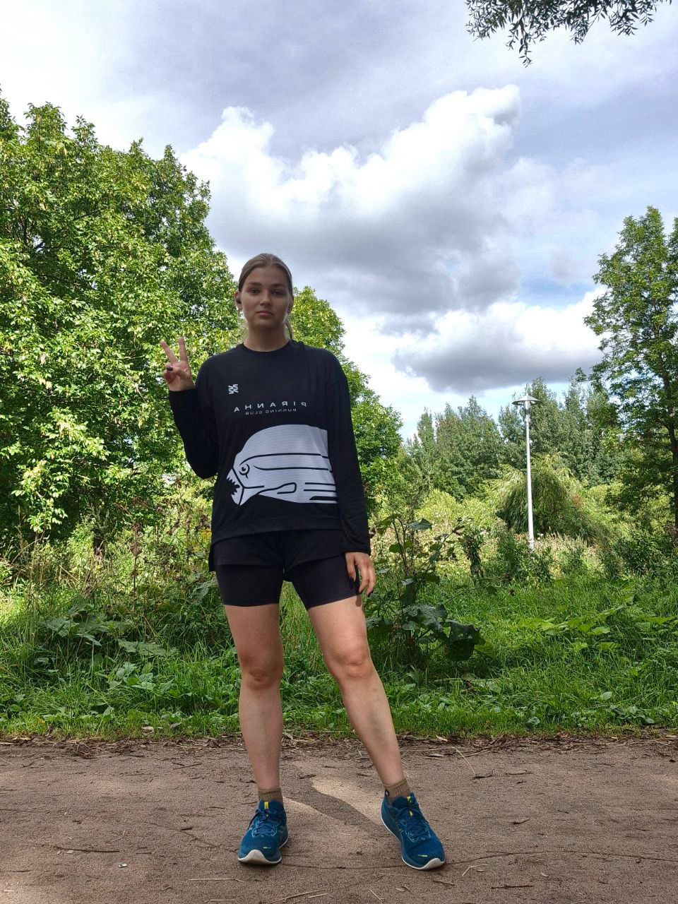

# Полулях Оксана
## 7 фактов обо мне:
1. Учила **программирование** в школе, правда это был **Паскаль**
2. Увлеклась бегом в 2025 году, ненавидя его большую часть своей жизнь
3. **Человек-план**, если у меня нет плана на эту или следующую неделю, скорее всего происходит катастрофа, а так я и следующий год могу запланировать
4. **Аналитический склад ума** для меня не просто слова, еще в школе анализировала, что нужно сказать и какое следствие из этого
5. Развитие через **формирование постоянных привычек** - моя философия
6. **Не жалею** о прошлом, с ним я **стала собой**
7. Есть кошка Тесса, которую я научила 4 командам
   

## Образование

* ВУЗ(в процессе) - РУК ПКИ "Управление организациями"
* Дополнительные обучения:
  * Нетология "Fullstak разработчик на Python"
  * SkyPro "Аналитик данных"

[Моя повседневная жизнь здесь](https://t.me/omyflow) 

